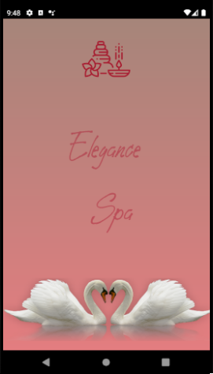
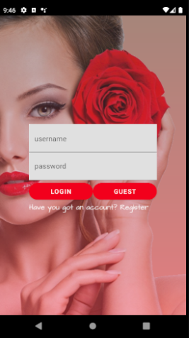
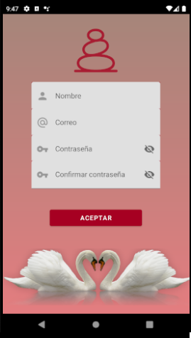
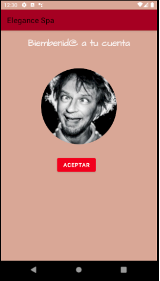
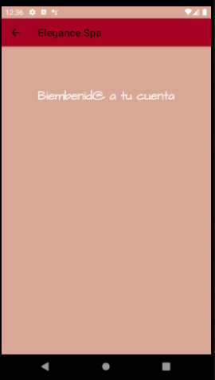

#**MyNiceStart**

[carlok en github](https://github.com/carlokg/)

* **Splash** Ventana de carga de la app, cuenta con una nimación y cambia progresivamente la iluminación del fondo, dándo paso al Login.
  * **Login** Ventana principal para logearse, desde aquí se puede iniciar sesión o pasar a la pantalla de registro me diante un hipervínculo.
                Cuenta con la versión editada de LandScape para cuadrar mejor la fotografía
  * **Registro** Ventana con campos editables para introducir los datos de la cuenta de usuario, al aceptar da paso al MainActivity.
         También cuanta con versión modificada de LandScape, separando la imágen en dos imágenes para que quede mejor

     *  **Activity principal** El el encontraremos la foto del usuario circular con Glide y un botón para pasar al siguiente activity2
     *  **Activity 2** Únicamente hay una appBar con una flecha de retorno al ActivityMain

*    **Capturas de la app:**

   |  |  | 

